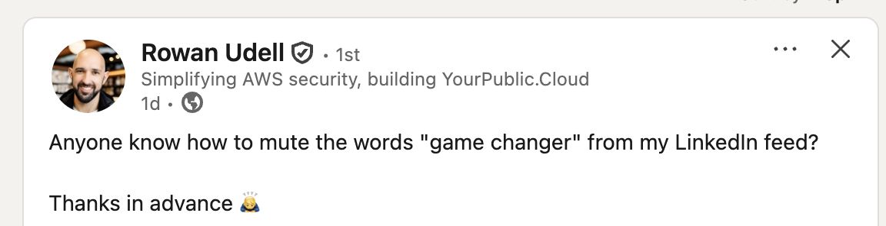
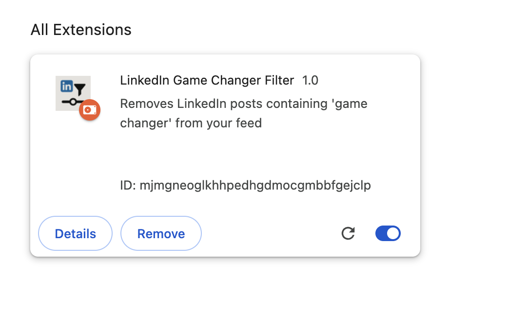

# LinkedIn Feed Filter
Chrome extension cleans up LinkedIn feed by hiding posts containing "game changer."

Requested by Rowan...


## Features

- **Automatic filtering** - Hides posts containing specified keywords as you browse
- **Real-time detection** - Works with LinkedIn's dynamic content loading
- **Lightweight** - Minimal performance impact on your browsing
- **Customizable** - Easy to modify filtered keywords

## Default filters
- "game changer"
- "game-changer" 
- "gamechanger"

## Installation
Not published on the Chrome Web Store, you'll need to install it manually:

### Step 1: Download the Extension
1. Clone this repository or download as ZIP:
   ```bash
   git clone https://github.com/micklove/linkedin-filter.git
   ```
   
2. If you downloaded a ZIP, extract it to a folder on your computer

### Step 2: Load in Chrome

1. Open Chrome and navigate to `chrome://extensions/`
2. **Enable Developer Mode** by toggling the switch in the top-right corner
3. Click **"Load unpacked"** button
4. Select the folder containing the extension files
5. The extension should now appear in your extensions list

### Step 3: Verify Installation
1. Visit [LinkedIn](https://www.linkedin.com)
2. Open Developer Tools (F12) and check the Console tab
3. You should see the message: "LinkedIn Game Changer Filter loaded"
4. Posts containing the filtered keywords will be automatically hidden from your feed

## Customization
To add or modify filtered keywords:
1. Open `content.js` in a text editor
2. Find the `filteredKeywords` array (around line 8):
   ```javascript
   const filteredKeywords = [
       'game changer',
       'game-changer',
       'gamechanger',
   'swarm' // for testing...
   ];
   ```

3. Add or remove keywords as desired:
   ```javascript
   const filteredKeywords = [
       'game changer',
       'paradigm shift',
       'revolutionary',
       'disruptive',
       'synergy'
   ];
   ```

4. Save file, reload the extension at `chrome://extensions/`

## How It Works
The extension uses a content script that:

1. **Scans LinkedIn posts** for specified keywords (case-insensitive)
2. **Hides matching posts** by setting their display to none
3. **Monitors for new content** using MutationObserver to catch dynamically loaded posts
4. **Processes posts efficiently** by marking already-checked posts to avoid redundant scanning

## Testing
For testing, we are filtering posts, with the word "swarm"
* Go to `chrome://extensions/`
  

  * Disable the extension, then...
     Go to https://www.linkedin.com/feed/update/urn:li:activity:7351115423532109825/
  
     The post should be visible<br><br> 
  * Enable the extension, then...
     Go to https://www.linkedin.com/feed/update/urn:li:activity:7351115423532109825/
  * Adrians post contains the word "swarm", so it should be filtered out
       * Reload the extension:
          Click the refresh icon next to the extension
## Troubleshooting

### Extension Not Working

- **Check if enabled**: Go to `chrome://extensions/` and ensure the extension is enabled
- **Reload the extension**: Click the refresh icon next to the extension
- **Check for errors**: Open Developer Tools (F12) on LinkedIn and look for error messages in the Console

### Posts Not Being Filtered

- **Verify keywords**: Check the Console for debug messages
- **LinkedIn updates**: LinkedIn occasionally changes their HTML structure, which may require updating the post selectors in `content.js`
- **Clear cache**: Try refreshing LinkedIn or clearing your browser cache

### Adding Debug Information
To see what posts are being processed, add this line after line 45 in `content.js`:

```javascript
console.log('Checking post:', postText.substring(0, 100));
```

## File Structure

```
linkedin-filter/
├── manifest.json          # Extension configuration
├── content.js             # Main filtering logic
├── icon16.png            # Extension icon (16x16)
├── icon48.png            # Extension icon (48x48)
├── icon128.png           # Extension icon (128x128)
└── README.md             # This file
```

## Browser Compatibility

- **Chrome** - Fully supported
- **Chromium-based browsers** (Edge, Brave, Opera) - Should work with minimal modifications
- **Firefox** - Would require manifest conversion for WebExtensions

## Privacy

This extension:
- ✅ **Does not collect any data**
- ✅ **Only runs on LinkedIn pages**
- ✅ **Works entirely locally in your browser**
- ✅ **Does not send information to external servers**

## Contributing

1. Fork this repository
2. Create a feature branch: `git checkout -b feature-name`
3. Make your changes
4. Test thoroughly on LinkedIn
5. Submit a pull request

### Common Contributions

- **New keyword suggestions** - Popular buzzwords to filter
- **UI improvements** - Options page for managing keywords
- **Bug fixes** - LinkedIn structure changes requiring selector updates
- **Performance optimizations** - Reducing impact on page load times

## License

MIT License - Feel free to modify and distribute

## Support

If you encounter issues:

Fork the repo and fix em

## Roadmap

Future enhancements being considered:

- [ ] None yet

---

**Disclaimer**: This extension is not affiliated with LinkedIn. Use responsibly and in accordance with LinkedIn's Terms of Service.
